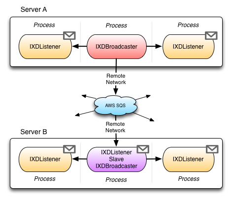



Transport implementations are loosely coupled to the core library, and it's not necessary to create project references to the transport assemblies themselves. In order to use specific implementations, the appropriate assembly must be placed in the application installation directory.

### Enable RemoteNetwork

The default implementation of `RemoteNetwork` mode uses `Amazon Web Services`, specifically SQS & SNS. The library will create instances of these services on demand provided valid AWS credentials are provided. Refer to the Amazon documentation with regard to any associated cost implications in using these services. The credentials issued by your Amazon account can be specified in the `app.config` file as follows.

	<?xml version="1.0"?>
	<configuration>
	  <appSettings>
		<add key="AWSAccessKey" value="#accesskey#"/>
		<add key="AWSSecretKey" value="#accesssecret#"/>
	  </appSettings>
	</configuration>
	
Alternatively it's possible to define these programmatically and set the desired AWS region.

	XDMessagingClient client = new XDMessagingClient()
		.WithAmazonSettings(accessKey, accessSecret, RegionEndPoint.EUWest1);

If using multiple applications with conflicting channel names, it's possible to additionally partition AWS messages by a unique name. This may be useful if deploying the same application to multiple test environments. In this case messages are only sent and received to applications with the same unique AWS key.

	XDMessagingClient client = new XDMessagingClient()
		.WithAmazonUniqueKey("qa");

### Network Propagation

Network propagation is a feature of the library that allows messages to leverage `HighPerformanceUI` or `Compatibility` modes, whilst additionally distributing messages to a remote server. `RemoteNetwork` mode is used under the hood to transfer messages to disconnected servers, and messages are rebroadcast by a slave `IXDListener` instance using the original transport mode. If the slave instance terminates for any reason, then another listener instance will automatically take it's place.

In order to use `NetworkPropagation` mode, the `RemoteNetwork` transport mode must be enabled.

In order to enable `NetworkPropagation` an additional flag is set when creating the `IXDBroadcaster` instance.

	// Create instance of HighPerformanceUI broadcaster and enable network propagation
	IXDBroadcaster broadcaster = client.Broadcasters
		.GetBroadcasterForMode(XDTransportMode.HighPerformanceUI, true);
	
### Sending Typed Objects

The library allows the sending of plain string messages, or strongly typed serializable objects. To send objects the sender and receiver must share a common class definition for the object.

	// Create serializable instance
	CustomMessage message = new CustomMessage();
	message.Name = "My Message";
	
	// Send the object to a channel named binary
	broadcaster.SendToChannel("binary", message);
	
	// Deserialise the strongly typed message
	listener.MessageReceived += (o,e) => {
		if (e.DataGram.Channel == "binary")
		{
		   TypedDataGram<CustomMessage> message = e.DataGram;
		   MessageBox.Show("Received CustomMessage: "+message.Name);
		}
	}		
		
### Explicit Modes

If project references are added to the transport assemblies, then extension methods are made available on `XDMessagingClient` which strong type the specific transport implementations (rather than relying on defaults).

	// Create listener instance using WindowsMessaging mode (HighPerformanceUI)
	IXDListener listener = client.Listeners.GetWindowsMessagingListener();
	
	// Create listener instance using IOStream mode (Compatibility)
	IXDListener listener = client.Listeners.GetIoStreamListener();
	
	// Create listener instance using Amazon mode (RemoteNetwork)
	IXDListener listener = client.Listeners.GetAmazonListener();
	
	// Create broadcaster instance using WindowsMessaging mode (HighPerformanceUI)
	IXDBroadcaster broadcaster = client.Broadcasters.GetWindowsMessagingBroadcaster();
	
	// Create broadcaster instance using IOStream mode (Compatibility)
	IXDBroadcaster broadcaster = client.Broadcasters.GetIoStreamListener();
	
	// Create broadcaster instance using Amazon mode (RemoteNetwork)
	IXDBroadcaster broadcaster = client.Broadcasters.GetAmazonListener();

### Multicast Broadcaster

The multicast broadcaster is capable of sending messages to multiple transport modes at once.

	IXDBroadcaster compatibility = client.Broadcasters
		.GetMulticastBroadcaster(XDTransportMode.Compatibility);
	IXDBroadcaster remoteNetwork = client.Broadcasters
		.GetMulticastBroadcaster(XDTransportMode.RemoteNetwork);

	IXDBroadcaster broadcaster = client.Broadcasters
		.GetMulticastBroadcaster(compatibility, remoteNetwork);
		
	broadcaster.SendToChannel("command", "message");
	
