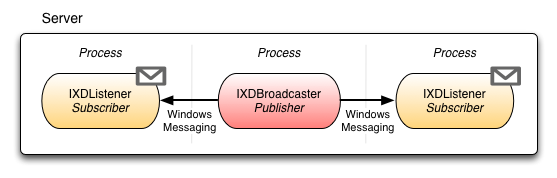



The XDMessaging library provides an easy-to-use, zero configuration solution to inter-process communication for .NET applications. It provides a simple API for broadcasting and receiving messages across application domain, process, and even network boundaries.

The library allows the use of user-defined pseudo channels through which messages may be sent and received. Any application can send a message to any channel, but it must register as a listener with the channel in order to receive. In this way developers can quickly and programmatically devise how their applications will communicate with each other best to work in harmony.

The XDMessaging library comes in 2 flavours. The full version provides the option to use Amazon Queues for sending and receiving messages to remote machines. It also supports network propagtion mode, which broadcasts messages to processes on remote machines as well as the local machine.

The XDMessaging.Lite version is for same box communication only, and is therefore is much more lightweight.

### Installation

Install the XDMessaging library using Nuget.

	PM> Install-Package XDMessaging
	
Install the XDMessaging.Lite library using Nuget.

	PM> Install-Package XDMessaging.Lite
	
### Advantages

The XDMessaging library offers some advantages over other IPC technologies like WCF, .Net Remoting, Sockets, NamedPipes and MailSlots. To begin with the library does not require a server-client relationship as there is no physical connection between processes.

With XDMessaging messages can be broadcast by multiple applications and instantly received by multiple listeners in a disconnected fashion. It's also worth noting that most of the existing IPC implementations require the opening of specific ports and somewhat painful configuration of settings to make work. With XDMessaging there is no configuration, the API determines where messages are sent, and which messages are received using pseudo channels.

